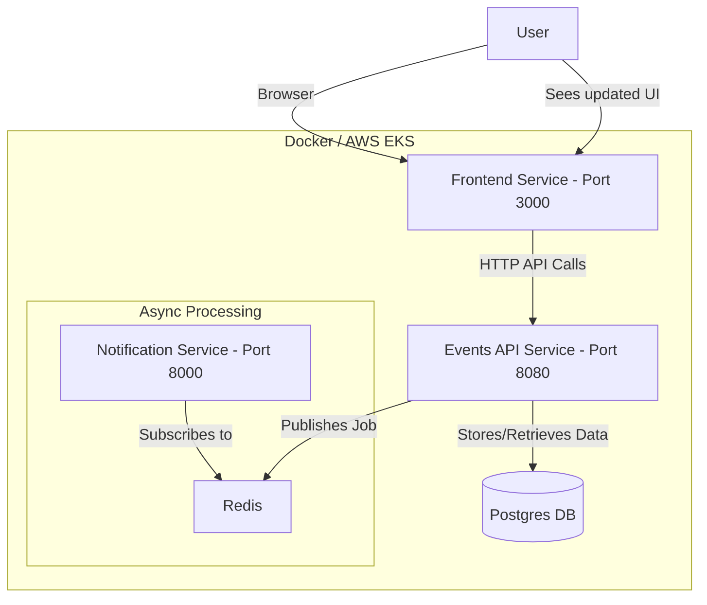

# CampusConnect: Smart Campus Event Management

CampusConnect is a modern, production-ready application for a smart campus event management system. This project is built using a **distributed microservices architecture**, showcasing key DevOps and cloud-native principles like containerization, orchestration, and CI/CD.

## Architecture: Distributed Microservices

The application is architected as a distributed system, where different logical components are separated into independent services. This approach ensures scalability, resilience, and technological flexibility.

- **Frontend Service**: A responsive UI built with **Next.js/React**, running on port `3000`.
- **Events API Service**: A backend service built with **Node.js/Express**, responsible for business logic and data persistence, running on port `8080`.
- **Notification Service**: A background worker service built with **Python/Flask** for handling asynchronous tasks, running on port `8000`.
- **Infrastructure**: The application stack also includes **PostgreSQL** for data storage and **Redis** for caching and messaging.

### Architecture Diagram (Mermaid.js)



## Prerequisites

Before you begin, ensure you have the following installed:
- [Node.js](https://nodejs.org/) (v18 or later)
- [Python](https://www.python.org/) (v3.9 or later)
- [Docker](https://www.docker.com/get-started) & [Docker Compose](https://docs.docker.com/compose/install/)

## Quick Start: Running with Docker Compose

The entire microservices stack is orchestrated with Docker Compose for a seamless local development experience.

1.  **Clone the repository:**
    ```bash
    git clone <repository-url>
    cd <repository-directory>
    ```

2.  **Build and run all services using Docker Compose:**
    ```bash
    docker compose up --build
    ```

    This command will:
    - Build the individual Docker images for the Frontend, Events API, and Notification services.
    - Pull the official images for PostgreSQL and Redis.
    - Create a shared network and start all five containers.

3.  **Access the application:**
    - The **Frontend** will be available at [http://localhost:3000](http://localhost:3000).
    - The **Events API** will be available at [http://localhost:8080](http://localhost:8080).
    - The **Notification Service** will be available at [http://localhost:8000](http://localhost:8000).

## API Documentation

The following API endpoints are exposed by the **Events API Service**:

### Events API (`http://localhost:8080`)

- **`GET /api/events`**
  - **Description**: Retrieves a list of all campus events.

- **`POST /api/events`**
  - **Description**: Creates a new event.

### Health Check APIs
Each service has its own health check endpoint for monitoring:
- **Frontend**: `http://localhost:3000/api/health`
- **Events API**: `http://localhost:8080/api/health`
- **Notification Service**: `http://localhost:8000/health`
