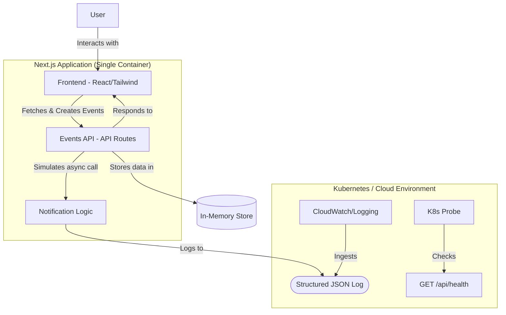

# CampusConnect: Smart Campus Event Management

CampusConnect is a modern, production-ready starter kit for a smart campus event management system. This project is designed as a capstone demonstration, built with Next.js and showcasing key DevOps principles like containerization, observability, and resilience within a well-structured monolithic architecture.

While the original proposal specified a multi-service, multi-language microservices architecture, this implementation adapts those concepts into a single, cohesive Next.js application. This approach simplifies local development and deployment while still maintaining a clear separation of concerns between the frontend UI, backend API, and notification logic.

## Architecture

The application is architected as a "well-structured monolith," where different logical components are separated within the same Next.js framework.

- **Frontend**: A responsive UI built with React Server Components and Client Components, styled with Tailwind CSS.
- **Events API**: Backend logic handled by Next.js API Routes, providing RESTful endpoints for event management.
- **Notification Logic**: Integrated directly into the Events API, simulating a call to a separate notification service. This demonstrates inter-service communication patterns and resilience.

### Architecture Diagram (Mermaid.js)



## Prerequisites

Before you begin, ensure you have the following installed:
- [Node.js](https://nodejs.org/) (v18 or later)
- [Docker](https://www.docker.com/get-started) & [Docker Compose](https://docs.docker.com/compose/install/)

## Quick Start

### Local Development (Recommended)

1.  **Install dependencies:**
    ```bash
    npm install
    ```

2.  **Run the development server:**
    ```bash
    npm run dev
    ```

    The application will be available at [http://localhost:9002](http://localhost:9002).

### Running with Docker

1.  **Build and run the container using Docker Compose:**
    ```bash
    docker-compose up --build
    ```

    The application will be available at [http://localhost:3000](http://localhost:3000).

## API Documentation

The following API endpoints are available:

### Events API

- **`GET /api/events`**
  - **Description**: Retrieves a list of all campus events.
  - **Success Response (200)**:
    ```json
    [
      {
        "id": "evt-1",
        "title": "Tech Talk: AI in Education",
        "date": "2024-10-15T14:00:00.000Z",
        "description": "Join us for an insightful discussion on how AI is transforming the educational landscape."
      }
    ]
    ```

- **`POST /api/events`**
  - **Description**: Creates a new event.
  - **Request Body**:
    ```json
    {
      "title": "New Event Title",
      "date": "YYYY-MM-DD",
      "description": "Event description."
    }
    ```
  - **Success Response (201)**:
    ```json
    {
      "id": "evt-...",
      "title": "New Event Title",
      "date": "...",
      "description": "Event description."
    }
    ```

### Health Check API

- **`GET /api/health`**
  - **Description**: A health check endpoint for monitoring services like Kubernetes probes.
  - **Success Response (200)**:
    ```json
    {
      "status": "healthy",
      "timestamp": "2024-08-01T12:00:00.000Z",
      "services": {
        "events-api": "healthy",
        "notification-service": "healthy"
      }
    }
    ```
